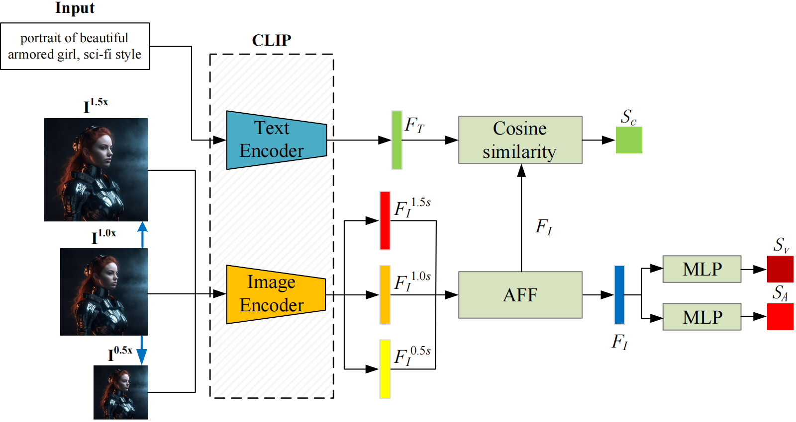

Adaptive Mixed-Scale Feature Fusion Network (AMFF-Net)
===========================
The official repo of [Adaptive Mixed-Scale Feature Fusion Network for Blind AI-Generated Image Quality Assessment](https://ieeexplore.ieee.org/abstract/document/10520989) (TBC 2024)
****
# Abstract
With the increasing maturity of the text-to-image and image-to-image generative models, 
AI-generated images (AGIs) have shown great application potential in advertisement, 
entertainment, education, social media, etc. Although remarkable advancements have been 
achieved in generative models, very few efforts have been paid to design relevant quality 
assessment  models. In this paper, we propose a novel blind image quality assessment (IQA)
network, named AMFF-Net, for AGIs. AMFF-Net evaluates AGI quality from three dimensions, i.e.,
''visual quality'', ''authenticity'', and ''consistency''. Specifically, inspired by the 
characteristics of the human visual system and motivated by the observation that ''visual 
quality'' and ''authenticity'' are characterized by both local and global aspects, AMFF-Net
scales the image up and down and takes the scaled images and original sized image as the 
inputs to obtain multi-scale features. After that, an Adaptive Feature Fusion (AFF) block 
is used to adaptively fuse the multi-scale features with learnable weights. In addition,
considering the correlation between the image and prompt, AMFF-Net compares the semantic
features from text encoder and image encoder to evaluate the text-to-image alignment. 
We carry out extensive experiments on three AGI quality assessment databases, and the 
experimental results show that our AMFF-Net obtains better performance than nine 
state-of-the-art blind IQA methods. The results of ablation experiments further demonstrate 
the effectiveness of the proposed multi-scale input strategy and AFF block.  
<div style="text-align: center;">
  
</div>

---
# Requirement
torch >= 1.8.0, Python == 3.7  
Before you start, run the following commands to install the environment
```
conda create -n Myenv python==3.7
conda activate Myenv
pip install -r requirements.txt
```
Download Databases
```
AGIQA3K: https://github.com/lcysyzxdxc/AGIQA-3k-Database
AIGCIQA2023: https://github.com/wangjiarui153/AIGCIQA2023
PKU-I2IQA: https://github.com/jiquan123/I2IQA
```

# Training on 10 splits
Set the **--AGIQA3K_set**, **--AGIQA3K_set**, and **--AGIQA3K_set** parameters in **MTD_IQA.py** to 
the addresses of your dataset file. Then run the following command.
```
python MTD_IQA.py
```

# Evaluation on test-sets
Set the **--goal** and **--datasets** parameters in **test.py** to the factor and dataset you want to 
test, and then run the following command.
```
python test.py
```

# Citation
```
@ARTICLE{10520989,
  author={Zhou, Tianwei and Tan, Songbai and Zhou, Wei and Luo, Yu and Wang, Yuan-Gen and Yue, Guanghui},
  journal={IEEE Transactions on Broadcasting}, 
  title={Adaptive Mixed-Scale Feature Fusion Network for Blind AI-Generated Image Quality Assessment}, 
  year={2024},
  volume={},
  number={},
  pages={1-11},
  keywords={Visualization;Distortion;Task analysis;Quality assessment;Feature extraction;Adaptation models;Image quality;AI-generated images;blind image quality assessment;adaptive feature fusion;multi-scale feature},
  doi={10.1109/TBC.2024.3391060}}
```
